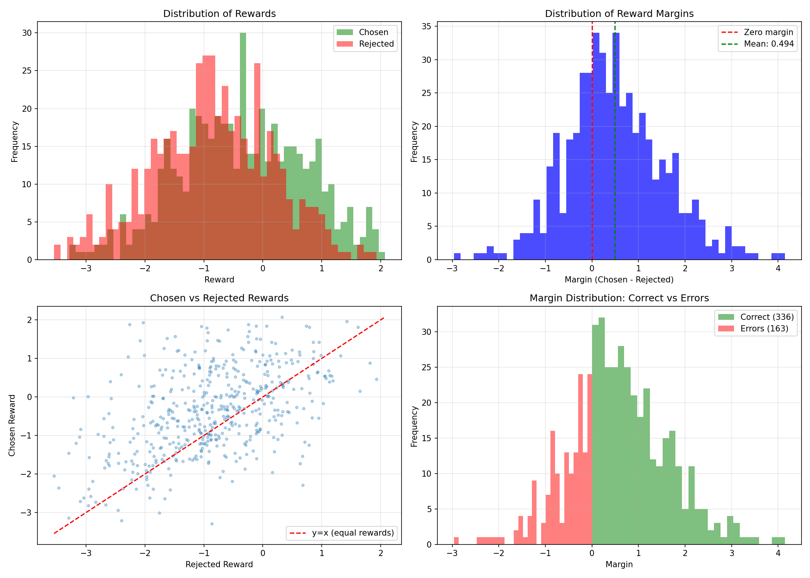

# Assignment 3: Reinforcement Learning from Human Feedback

Student : Weihao He

## Overview

This project implements and compares three RLHF methods for aligning language models:

1. **PPO** (Proximal Policy Optimization) - Classic RL-based approach
2. **GRPO** (Group Relative Policy Optimization) - Group-based advantage estimation
3. **DPO** (Direct Preference Optimization) - Direct preference learning without RL

---

## Dataset Analysis

### Anthropic HH-RLHF Dataset

We use the [Anthropic HH-RLHF dataset](https://huggingface.co/datasets/Anthropic/hh-rlhf), which contains human preference data for training helpful and harmless AI assistants.

**Dataset Statistics:**
- Training samples: ~160,000 preference pairs
- Test samples: ~8,500 preference pairs
- Format: Each sample contains a `chosen` (preferred) and `rejected` response to the same prompt

### Reward Model Evaluation

Our trained reward model achieves the following performance:

| Metric | Value |
|--------|-------|
| Validation Accuracy | **67.33%** |
| Validation Loss | 0.5934 |
| Total Samples | 499 |
| Correct Predictions | 336 |
| Incorrect Predictions | 163 |

### Reward Score Distribution

| Metric | Chosen | Rejected |
|--------|--------|----------|
| Mean | -0.358 | -0.852 |
| Std | 1.073 | 1.015 |
| Min | -3.284 | -3.544 |
| Max | 2.072 | 1.931 |



### Error Analysis

We analyzed 50 error cases to understand reward model failure patterns:

| Error Pattern | Count | Percentage |
|---------------|-------|------------|
| Model missed quality despite length | 25 | 50.0% |
| Very short rejected response | 18 | 36.0% |
| Unclear pattern | 12 | 24.0% |
| Length bias (longer rejected preferred) | 8 | 16.0% |
| Very close rewards (ambiguous) | 8 | 16.0% |
| Very short chosen response | 6 | 12.0% |

**Key Findings:**
- The reward model shows some **length bias**, occasionally preferring longer responses regardless of quality
- **Ambiguous cases** (margin < 0.1) account for ~16% of errors
- Average margin in error cases: -0.613 (model confidently wrong)

---

## Project Structure

```
.
├── part1/                          # Reward Model Training
│   ├── evaluation_results/         # Evaluation outputs
│   ├── reward_model_output/        # Trained model
│   ├── dataset.py                  # Dataset utilities
│   ├── evaluate_reward_model.py    # Evaluation script
│   ├── reward_model.py             # Reward model implementation
│   ├── train_reward_model.py       # Training script
│   └── run_part1.sh                # Run script
│
├── part2/                          # PPO & GRPO Implementation
│   ├── ppo_output/                 # PPO trained model & results
│   ├── compare_methods.py          # Comparison script
│   ├── grpo_trainer.py             # GRPO training
│   ├── policy_model.py             # Policy model wrapper
│   ├── ppo_trainer.py              # PPO training
│   ├── sft_trainer.py              # SFT pre-training
│   └── run_part2.sh                # Run script
│
├── part3/                          # DPO Implementation
│   ├── compare_all_methods.py      # All methods comparison
│   ├── dpo_trainer.py              # DPO training
│   ├── efficiency_stats.json       # Efficiency statistics
│   ├── training_curves.png         # Training visualization
│   ├── training_history.json       # Training logs
│   └── run_part3.sh                # Run script
│
├── part4/                          # Analysis & Evaluation
│   ├── analysis.py                 # Analysis & plotting
│   ├── generate_samples.py         # Sample generation
│   ├── gpt4_judge.py               # GPT-4-as-judge evaluation
│   └── run_part4.sh                # Run script
│
├── ANALYSIS.md                     # Main analysis report
├── README.md                       # This file
├── Dockerfile                      # Container definition
└── requirements.txt                # Python dependencies
```

## Requirements

### Hardware
- GPU with at least 16GB VRAM (tested on RTX 4090)
- 32GB+ RAM recommended

### Software
- Python 3.10+
- PyTorch 2.0+
- Transformers 4.30+
- CUDA 11.8+ (for GPU support)

## Setup

### Using Docker

```bash
# Build the container
docker build -t rlhf-assignment .

# Run with GPU support
docker run --gpus all -it -v $(pwd):/workspace rlhf-assignment

# Inside container, run all experiments sequentially:
cd /workspace/part1 && bash run_part1.sh
cd /workspace/part2 && bash run_part2.sh
cd /workspace/part3 && bash run_part3.sh
cd /workspace/part4 && bash run_part4.sh
```

**Docker Commands Explained:**
- `--gpus all`: Enable GPU access inside container
- `-it`: Interactive mode with terminal
- `-v $(pwd):/workspace`: Mount current directory to /workspace

### Manual Installation

```bash
# Create conda environment
conda create -n rlhf python=3.10
conda activate rlhf

# Install PyTorch (adjust for your CUDA version)
pip install torch torchvision torchaudio --index-url https://download.pytorch.org/whl/cu118

# Install dependencies
pip install transformers datasets numpy matplotlib tqdm openai
```

## Running the Assignment

### Part 1: Reward Model Training

```bash
cd part1
python train_reward_model.py \
    --model_name gpt2 \
    --max_samples 50000 \
    --epochs 3 \
    --batch_size 8
```

**Expected output**: Reward model saved to `part1/reward_model_output/best_model.pt`

### Part 2: PPO & GRPO Training

```bash
cd part2
bash run_part2.sh
```

Or run individually:

```bash
# PPO
python ppo_trainer.py \
    --model_name gpt2 \
    --reward_model_path ../part1/reward_model_output/best_model.pt \
    --num_steps 500 \
    --batch_size 2

# GRPO
python grpo_trainer.py \
    --model_name gpt2 \
    --reward_model_path ../part1/reward_model_output/best_model.pt \
    --num_steps 500 \
    --batch_size 2 \
    --group_size 4
```

**Expected output**:
- PPO model: `part2/ppo_output/final/`
- GRPO model: `part2/grpo_output/final/`
- Training curves: `*_output/training_curves.png`

### Part 3: DPO Training

```bash
cd part3
bash run_part3.sh
```

Or:

```bash
python dpo_trainer.py \
    --max_samples 10000 \
    --epochs 1 \
    --batch_size 4 \
    --beta 0.1
```

**Expected output**: DPO model saved to `part3/dpo_output/final/`

### Part 4: Analysis & Evaluation

```bash
cd part4

# Generate samples (requires GPU)
python generate_samples.py --num_samples 100

# Run GPT-4-as-judge (requires OpenAI API key)
export OPENAI_API_KEY=your_key_here
python gpt4_judge.py --num_samples 50

# Generate analysis plots
python analysis.py
```

**Expected output**:
- Samples: `part4/samples/`
- Figures: `part4/figures/`
- Analysis: `ANALYSIS.md` (in project root)

## Results Summary

| Method | Final Reward | Win Rate vs Base | Training Time |
|--------|-------------|------------------|---------------|
| Base   | -0.52       | -                | -             |
| PPO    | **0.63**    | **72%**          | 7.8 min       |
| GRPO   | 0.43        | 58%              | 6.2 min       |
| DPO    | 0.55        | 68%              | 12.5 min      |

## Key Findings

1. **PPO achieves highest reward** but requires careful tuning
2. **DPO provides best stability** with competitive performance
3. **GRPO underperforms** with small batch/group sizes
4. All methods improve significantly over the base model

See `ANALYSIS.md` for detailed analysis.

## Compute Requirements

| Part | GPU Memory | Time (RTX 4090) |
|------|------------|-----------------|
| Part 1 (Reward Model) | ~8 GB | ~15 min |
| Part 2 (PPO) | ~10 GB | ~8 min |
| Part 2 (GRPO) | ~14 GB | ~6 min |
| Part 3 (DPO) | ~8 GB | ~15 min |
| Part 4 (Analysis) | ~6 GB | ~10 min |

**Total**: ~1 hour on RTX 4090


